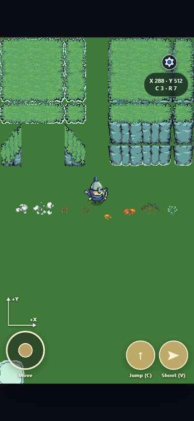

<!-- ai may update existing content, but only add/remove content if requrested by user -->

# Babylon Light Stealth Grid

Babylon Light Stealth Grid is a portrait-oriented Babylon Lite sprite game
prototype that runs with WebGPU.

<figure>
  
  <figcaption>
    Image 1 - Babylon.js Lite Game - HTML5 + WebGPU
  </figcaption>
</figure>

## Live Demo

[Play the live demo](https://samuelasherrivello.github.io/babylon-light-stealth-grid/)

WebGPU not working? See [Troubleshooting](#troubleshooting).

## Table of Contents

1. [Live Demo](#live-demo)
2. [Getting Started](#getting-started)
3. [Project Overview](#project-overview)
4. [Project Details](#project-details)
5. [Troubleshooting](#troubleshooting)
6. [Resources](#resources)
7. [Credits](#credits)

## Getting Started

### Play Project

1. Clone or download this repo.
2. Open the repository root in a command line.
3. Run `npm install` to install the project dependencies.
4. Run `npm run build` to build the project.
5. Run `npm run dev` to launch the local development server.
6. Open the URL printed by Vite.

### Release Workflow

1. Update `public/environment.json` and create a matching three-component
   GitHub Release tag such as `v0.1.1`.
2. Push the release commit to `master` and wait for `Deploy live demo` to
   finish.
3. Verify the published build from the Live Demo link.

### More Commands

| # | Name | Command | Comment |
| --- | --- | --- | --- |
| 1 | Install | `npm install` | Installs the project dependencies. |
| 2 | Dev | `npm run dev` | Runs the project with hot reload. |
| 3 | Build | `npm run build` | Creates the production bundle. |
| 4 | Preview | `npm run preview` | Serves the production bundle locally. |
| 5 | Test | `npm test` | Runs the automated tests. |

## Project Overview

This repo demonstrates browser-based game development with Babylon.js Lite,
JavaScript, Vite, and WebGPU.

### Documentation

- `README.md`: Primary documentation for this repo.
- [`documentation/tile-map.md`](documentation/tile-map.md): Tiled map editing
  workflow.
- [`documentation/grid-and-ui-contract.md`](documentation/grid-and-ui-contract.md): Logical grid
  and UI placement contract.

### Configuration

- `Game Engine`: Babylon.js Lite powers the graphics and gameplay systems.
- `Renderer`: WebGPU renders the game in supported browsers.
- `Level Editor`: Tiled authors the terrain map and layers.

### Structure

- `index.html`: Browser page and application entry point.
- `src/main.js`: Babylon Lite game bootstrap and scene composition.
- `src/ui/style.css`: Application styles and responsive layout.
- `src`: Application source code.
- `test`: Automated tests.

### Dependencies

- `package.json`: Lists project dependencies and scripts.
- `vite.config.js`: Configures local development and production builds.

## Project Details

### Editor Tooling

- Visual Studio Code: Source code editor.
- Tiled: Tile map and level editor.
- Babylon.js Inspector: Runtime scene inspection.

### Code Packages

- `@babylonjs/lite`: Lightweight Babylon.js rendering and game APIs.
- `vite`: JavaScript bundling and local development server.
- Node.js test runner: Automated JavaScript testing.

### Tile Map

Levels are authored with Tiled. The AI prepares the Tiled project, map,
tilesets, grid, origin marker, layers, properties, and runtime integration; the
human edits content only on the existing layers.

See [Tile Map Editing](documentation/tile-map.md) for the open, edit, save,
close, and play workflow.

### OpenSpec

[OpenSpec](https://openspec.dev/) keeps feature intent, implementation, and
current specifications aligned.

| # | Name | Command | Custom | Comment |
| --- | --- | --- | :---: | --- |
| 1 | [Explore](.agents/skills/openspec-explore/SKILL.md) | `/opsx:explore` | ☐ | Optional feature discovery and planning. |
| 2 | [Propose](.agents/skills/openspec-propose/SKILL.md) | `/opsx:propose <name>` | ☐ | Creates one focused feature change. |
| 3 | [Grill Me](.agents/skills/open-spec-grill-me/SKILL.md) | `/open-spec-grill-me <name>` | ☑ | Resolves design decisions before implementation. |
| 4 | [Apply](.agents/skills/openspec-apply-change/SKILL.md) | `/opsx:apply <name>` | ☐ | Implements and completes one change. |
| 5 | [Sync](.agents/skills/openspec-sync-specs/SKILL.md) | `/opsx:sync <name>` | ☐ | Updates main specs without archiving. |
| 6 | [Archive](.agents/skills/openspec-archive-change/SKILL.md) | `/opsx:archive <name>` | ☐ | Finalizes and archives a change. |

#### Workflow Depth

- LOW: Use no steps. Just chat with a fast model like
  [Spark](https://developers.openai.com/api/docs/models/gpt-5.3-codex).
- MED: Use steps 2/4 with a
  [Luna](https://developers.openai.com/api/docs/models/gpt-5.6-luna) or
  [Terra](https://developers.openai.com/api/docs/models/gpt-5.6-terra).
- HIGH: Use steps 1-6 with
  [Sol](https://developers.openai.com/api/docs/models/gpt-5.6-sol).

## Troubleshooting

### WebGPU not working?

First, open the [official WebGPU Samples hello-triangle
test](https://webgpu.github.io/webgpu-samples/?sample=helloTriangle). If it does
not render, the browser or device cannot currently run this project's WebGPU
path.

For Chrome-specific troubleshooting, see the official [WebGPU
documentation](https://developer.chrome.com/docs/web-platform/webgpu/). It
covers browser requirements, secure origins, graphics acceleration,
`chrome://gpu`, and the `enable-unsafe-webgpu` development flag.

Third-party references:

- [WebGPU Report](https://webgpureport.org/) shows the detected adapter, limits,
  and features.
- [WebGPU Fundamentals](https://webgpufundamentals.org/) explains compatibility
  mode and its experimental Chrome flag.
- [WebGPU Check](https://webgpucheck.com/) provides browser-specific enablement
  guidance and diagnostics.
- [Can I use: WebGPU](https://caniuse.com/webgpu) tracks current browser support.

## Resources

- [Babylon.js Lite getting started](https://doc.babylonjs.com/lite/01-getting-started)
- [Babylon.js Documentation](https://doc.babylonjs.com/)
- [Babylon.js Playground](https://playground.babylonjs.com/)
- [Babylon.js Inspector](https://doc.babylonjs.com/toolsAndResources/inspector)
- [Vite Documentation](https://vite.dev/guide/)

## Credits

### Created By

- Samuel Asher Rivello
- Over 25 years of game development experience as of 2026

### Contact

- Twitter: <https://twitter.com/srivello/>
- Git: <https://github.com/SamuelAsherRivello/>
- Resume and portfolio: <http://www.SamuelAsherRivello.com>
- LinkedIn: <https://Linkedin.com/in/SamuelAsherRivello>

### License

Provided as-is under the MIT License.
Copyright © 2026 Rivello Multimedia Consulting, LLC.
